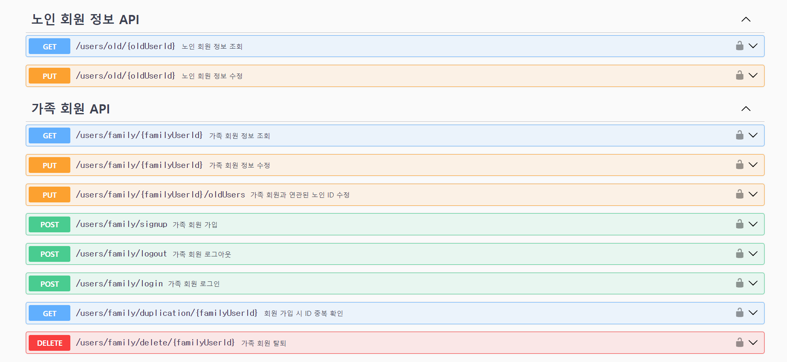
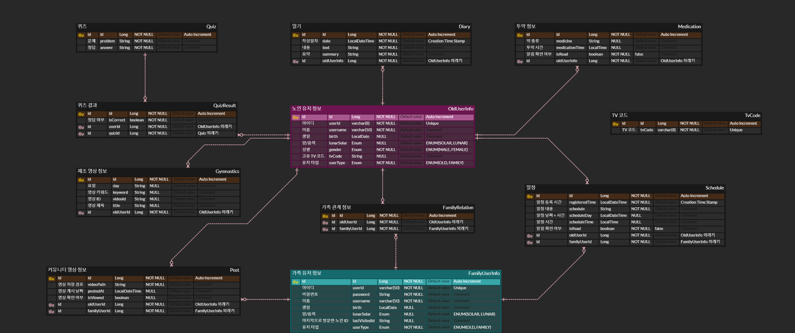

# 웹/모바일(웹 IoT) 프로젝트

<!-- 필수 항목 -->

## 카테고리

| Application                       | Domain                                | Language                         | Framework                            |
| --------------------------------- | ------------------------------------- | -------------------------------- | ------------------------------------ |
| :black_square_button: Desktop Web    | :white_check_mark: AI              | :white_check_mark: JavaScript    | :black_square_button: Vue.js         |
| :white_check_mark: Mobile Web  | :black_square_button: Big Data        | :white_check_mark: TypeScript | :white_check_mark: React             |
| :white_check_mark: Responsive Web | :black_square_button: Blockchain      | :black_square_button: C/C++      | :black_square_button: Angular        |
| :black_square_button: Android App | :white_check_mark: IoT                | :black_square_button: C#         | :white_check_mark: Node.js        |
| :black_square_button: iOS App     | :black_square_button: AR/VR/Metaverse | :white_check_mark: ​Python       | :white_check_mark: Flask/Django   |
| :black_square_button: Desktop App | :black_square_button: Game            | :white_check_mark: Java       | :white_check_mark: Spring/Springboot |
|:white_check_mark: Television App  |                                       | :black_square_button: Kotlin     |                                      |

<!-- 필수 항목 -->

## 프로젝트 소개

- 프로젝트명: 노블리TV
- 서비스 특징: 홀로 어르신의 삶에 정서적 연결고리를 제공하여 외로움을 해소할 수 있는 AI 셋톱박스
- 주요 기능
  - TV 셋톱박스
  - 오늘의 일기 음성으로 작성 후, 텍스트로 변환하여 보호자에게 전달.
    - 노인의 우울증 및 치매 척도 측정의 자료가 될 수도 있음.
  - 어르신들이나 건망증이 심한 분들의 중요한 일정의 자녀들이 대신 일정 등록해주고 알림을 보낼 수 있도록 하기.
  - 치매 예방
    - 치매 예방 체조 하기
    - 치매 예방 미니 게임
  - 가족들과의 커뮤니티
    - 체조 영상 촬영 후 커뮤니티에 올리는 기능
    - 가족들이 영상을 올리면 TV에서 시청 가능
  - 초음파센서와 TV에 달린 카메라로 독거노인 상태 체크
    - 주의 : 8시간동안 움직임이 없는 경우
    - 경보: 12시간동안 움직임이 없는 경우
    - 위험: 24시간동안 움직임이 없는 경우
    - 점검: 기계 통신이 안되는 경우, 데이터 송수신이 안될 때
    - 낙상: 낙상 감지 모델을 사용하여 위험 감지
- 주요 기술
  - Single Page Application
  - Jetson Nano
  - Raspberry Pico H
  - REST API
- 참조 리소스
  - .
- 배포 환경
  - URL:
  - 테스트 계정:

<!-- 자유 양식 -->

## 팀 소개

- 김민주: 팀장, 임베디드 개발, 프로젝트 총괄
- 강대수: 백앤드 개발
- 송강산: 프론트 개발
- 오민상: 발표자, 프론트 개발
- 이지호: 백앤드 개발
- 현상균: 서기, 임베디드 개발

<!-- 자유 양식 -->

## 프로젝트 상세 설명

// 개발 환경, 기술 스택, 시스템 구성도, ERD, 기능 상세 설명 등

## ⚠️ commit 컨벤션

**commmit, push 전에 pull 하는 습관을 들입시다!**

> commit 컨벤션은 [gitmoji](https://gitmoji.dev/)
> 와 [AngularJS Git Commit Message Conventions](https://gist.github.com/stephenparish/9941e89d80e2bc58a153)을 참고했습니다.

- "태그: {커밋 메시지}" 형태로 작성

### 💡 예시

`✨feat: 로그인 기능 구현`

#### 이모지 및 태그

- 이모지는 선택에 따라 활용한다.

| 이모지 | 태그     | 설명                                  |
| :----- | :------- | :------------------------------------ |
| ✨     | feat     | 새로운 기능 추가                      |
| 🐛     | fix      | 버그 수정                             |
| ♻️     | refactor | 코드 리팩토링                         |
| ✏️     | comment  | 주석 추가(코드 변경 X) 혹은 오타 수정 |
| 📝     | docs     | README와 같은 문서 수정               |
| 🔀     | merge    | merge                                 |
| 🚚     | rename   | 파일, 폴더명 수정 혹은 이동           |

## ⚠️ coding 컨벤션


### frontend coding 컨벤션

#### 소개
본 항목은 프로젝트에 적용된 코딩 컨벤션과 관련 도구에 대한 안내를 제공합니다. 우리는 ESLint와 Prettier를 사용하여 코드 품질을 유지하고 일관된 코드 스타일을 보장합니다.

#### ESLint
- eslint-config-airbnb-typescript 를 통해 Airbnb의 TypeScript 스타일 가이드를 따릅니다

#### Prettier
- prettier를 통해 일관된 코드 스타일을 유지합니다.


## ⚠️ nameing 컨벤션

### frontend nameing 컨벤션

- 모든 이름은 조금 길어지더라도 역할이 분명하게 명명해야합니다.

#### 1. 폴더명
  - camel**C**ase로 작성합니다.
#### 2. 컴포넌트(styled component 포함) 명
  - **P**ascal**C**ase
#### 3. 변수명
  - camel**C**ase로 작성합니다.
#### 4. 함수명
  - camel**C**ase로 작성합니다.
#### 5. 상수
  - 대문자와 밑줄을 사용한 **SNAKE_CASE**로 작성합니다.
#### 1. asset 파일명
- 소문자로 작성합니다.

### BackEnd Naming Convention
1. Java
  - Naming
    - 상수 : 대문자와 _(언더바)로 구성한다.
      ```java
      public int POSTAL_CODE_EXPRESSION = 1;
      ```
    - 변수명, 클래스명, 메서드명 : 영어, 숫자만을 사용한다.
    - 패키지명 : 소문자를 사용하여 작성한다. 단어별 구분을 위해 대문자, _(언더바)를 섞지 않는다.
      ```java
      package com.navercorp.apigateway;
      ```
    - 클래스명, 인터페이스명에는 첫 번째 단어가 대문자인 CamelCase를 적용한다.
      ```java
      public class AccessToken {
      ```
    - 변수명, 메서드명은 첫 번째 단어 소문자 camelCase를 사용한다.
      ```java
      private int accessToken;
      ```
    - 테스트를 위한 클래스명은 Test를 마지막에 붙인다.
      ```java
      public class WeatherTest {
      ```
    - 어떤 역할을 하는 지 파악할 수 있도록 Naming을 정의한다.
  - Declarations
    - 한 줄에 한 문장
      ```java
      int base = 0;
      int weight = 2;
      ```
    - 하나의 선언문에는 하나의 변수만
      ```java
      int base;
      int weight;
      ```
    - 배열에서 대괄호는 타입 뒤에 선언한다.
      ```java
      String[] names;
      ```
    - long 타입의 숫자에는 마지막에 대문자 L을 붙인다.
      ```java
      long base = 54423234211L;
      ```
  - 들여쓰기
    - 스페이스를 사용하지 않고 Tab을 이용하여 들여쓴다.
    - IDE 내에서 1개의 탭은 4개의 스페이스와 같도록 설정한다.
    - 클래스, 메서드, 제어문 등 코드 블럭이 생길 때마다 1단계를 더 들여쓴다.
  - 중괄호
    - 중괄호 사용 시 스페이스 1번 사용 후 시작 중괄호를 삽입하고, 종괄호를 마칠 때는 새 줄 삽입 후 중괄호를 닫는다.
      ```java
      public boolean isValidExpression(String exp) {

          if (exp == null) {
              return false;
          }
      }
      ```
    - 닫는 중괄호와 같은 줄에 else, catch, finally, while을 선언한다.
      ```java
      if (line.startWith(WARNING_PREFIX)) {
          return LogPattern.WARN;
      } else if (line.startWith(DANGER_PREFIX)) {
          return LogPattern.NORMAL;
      } else {
          return LogPattern.NORMAL;
      }
      ```
    - 내용이 없는 블럭을 선언할 때는 같은 줄에서 중괄호를 열고 닫는다.
      ```java
      public void close() {}
      ```
    - 조건, 반복문이 한 줄로 끝나도 중괄호는 필수로 사용한다.
      ```java
      if (exp == null) {
          return false;
      }
      ```
  - 줄바꿈
    - package, import 선언문은 한 줄로 쓴다.
  - 빈 줄
    - package 선언 후에는 빈 줄을 한 줄 삽입한다.
      ```java
      package com.naver.lucy.util;

      import java.util.Date;
      ```
    - 메서드 사이에는 빈 줄을 한 줄 삽입한다.
      ```java
      public void setId(int id) {
          this.id = id;
      }

      public void setName(String name) {
          this.name = name;
      }
      ```
  - 공백
    - 닫는 대괄호 뒤에 다른 선언이 올 경우에는 공백을 삽입한다.
      ```java
      int[] masks = new int[] {0, 1, 1};
      ```
    - 제어문 키워드와 여는 소괄호 사이에는 공백을 삽입한다.
      ```java
      if (maxLine > LIMITED) {
          return false;
      }
      ```
    - 식별자와 여는 소괄호 사이에는 공백을 삽입하지 않는다.
      ```java
      public StringProcessor() {} // 생성자

      @Cached("local")
      public String removeEndingDot(String original) {
          assertNotNull(original);
          ...
      }
      ```
    - 반복문 내에서 구분을 위해 쓰는 세미콜론(;)에는 뒤에만 공백을 삽입한다.
      ```java
      for (int i = 0; i < length; i++) {
          display(level, message, i)
      }
      ```
    - 반복문과 삼항연산자 내에서 쓰는 콜론(:)의 앞 뒤에는 공백을 삽입한다.
      ```java
      for (Customer customer : visitedCustomers) {
          AccessPattern pattern = isAbnormal(accessLog) ? AccessPattern.ABUSE : AccessPattern.NORMAL;
          int grade = evaluate(customer, pattern);

          switch (grade) {
              case GOLD :
                  sendSms(customer);
              case SILVER :
                  sendEmail(customer);
              default :
                  inreasePoint(customer)
          }
      }
      ```
    - 연산자를 사용할 시 앞 뒤에 공백을 삽입한다.
  - 주석
    - 코드 줄 바로 뒤에 주석을 붙일 때는 //을 사용하여 주석을 작성한다.
    - 코드와 별개로 주석을 작성할 때는 예시와 같이 주석을 작성한다.
      - 예시
        ```java
        /*
        * 공백 후 주석 내용 시작
        */
        ```
## 프로젝트 산출물
  1. 기능 명세서
  - [기능 명세서](https://www.notion.so/minju98/8e23409ab41f460da94377b842fe4316?v=bf049a1dff9b4514b016a50d506d2f5a)
  2. 요구 사항 명세서
  - [요구 사항 명세서](https://www.notion.so/minju98/1598af230a404e8c8f51531f8d981cdb)
  3. API 명세서
  - [REST API 연동 규격서](https://www.notion.so/minju98/Rest-API-590a12f831eb43c8882928b6f9f6b144)
  - Swagger를 통해서도 API 명세서 정리
  
  4. ERD
  
  5. 시스템 아키텍처
  