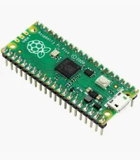
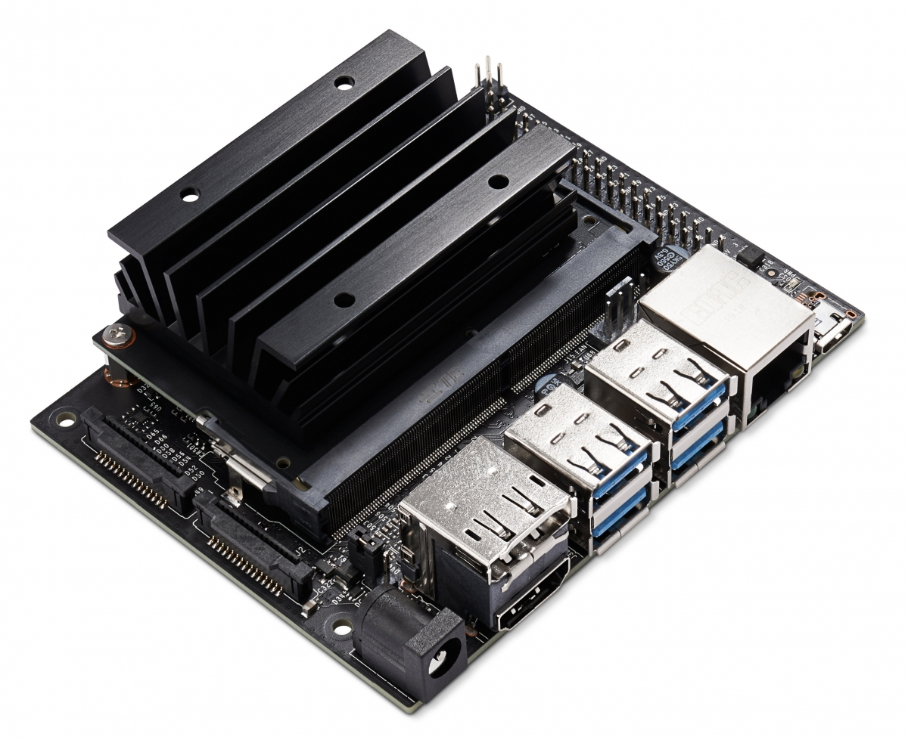
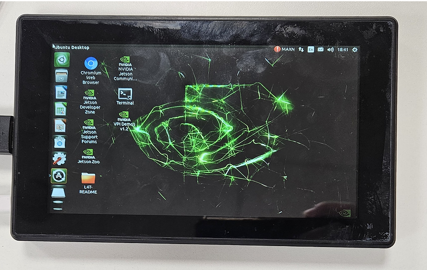

# 240115

## TIL
+ 칩셋에 OS를 올리기 전에 SD카드를 포맷을 해야한다. 포맷하지 않고 OS를 올려서 재설치에 많은 시간을 소요했다.
+ 라즈베리파이 피코는 라즈비안 OS를 설치하지 않는다. 마이크로 파이썬만 설치하면 사용할 수 있다.

---

## Raspberry Pi Pico H

+ RP2040 마이크로 컨트롤러
+ 듀얼코어 Arm Cortex-M0+ 프로세서 (133MHz)
+ 264KB SRAM, 2MB QSPI Flash 내장
+ 26 x GPIO Pins
+ 2 x UART, 2 x SPI, 2 x I2C, 16 x PWM

### Setup
+ [MicroPython 설치](https://www.raspberrypi.com/documentation/microcontrollers/micropython.html)
+ [PC에 Thonny 설치](https://thonny.org/)

---

## Jetson Nano Developer Kit

+ AI 연산에 주로 쓰이는 엔비디아 기반 메인보드
+ 쿼드코어 ARM Cortex-A57 프로세서 (1.43GHz)
+ 4GB 64-bit LPDDR4, 마이크로 SD

### Setup
+ [OS 설치](https://developer.nvidia.com/embedded/learn/get-started-jetson-nano-devkit)

