# 프로젝트 흐름
## 기획
  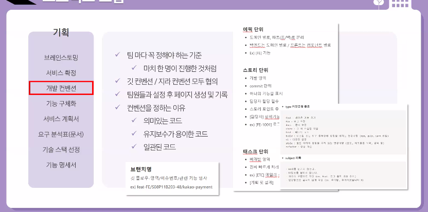
  - 개발 컨벤션
    - 팀 마다 꼭 정해야 하는 기준
      - 마치 한 명이 진행한 것처럼
    
    - 깃 컨벤션/ 지라 컨센션 모두 협의
    
    - 팀원들과 설정 후 페이지 생성 및 기록
    
    - 컨벤션을 하는 이유
      - 의미있는 코드
      - 유지보수가 용이한 코드
      - 일관된 코드
    
  - 기술 스택 선정
    
    - 단순 나열 x
    - 버전까지 상세하게 작성

  - 기능 명세서
    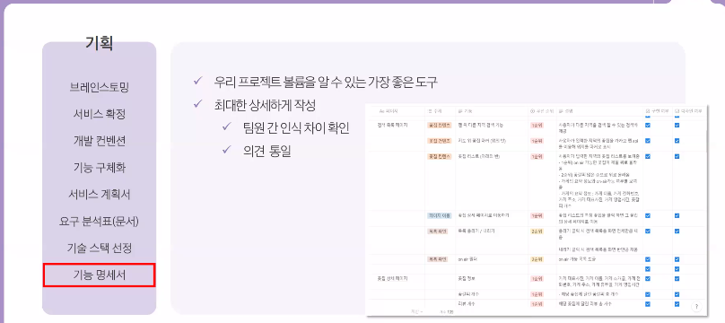

## 설계
  - 디자인 시스템
    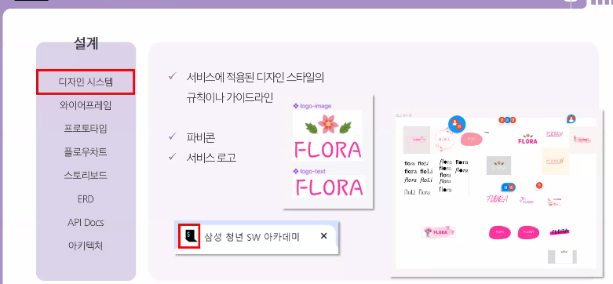

    - 파피콘 
      - ex) 빨간색 네모의 싸피 로고

    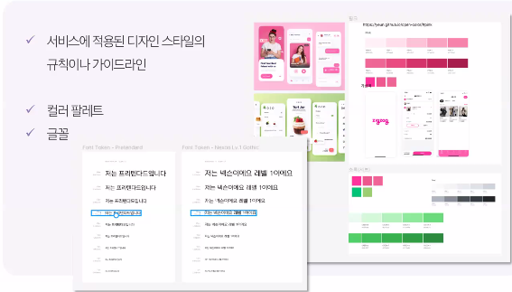
      - 피그마 이용시 플러그인 사용 => 편하게 사용 가능
    
    
      - 컴포넌트가 변화할때마다 명확하게 표현하는 것이 좋음

  - 와이어 프레임
    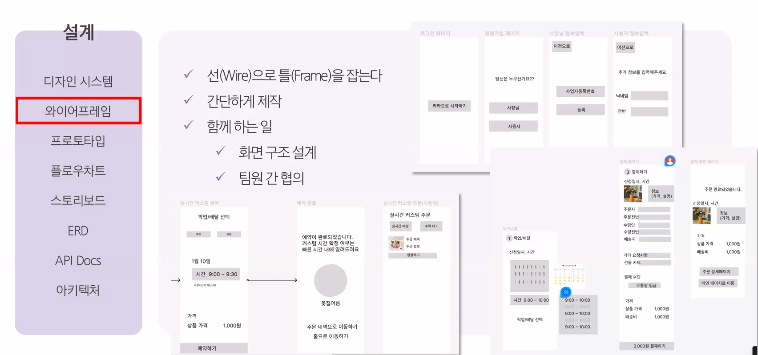

  - 스토리 보드
    

  - ERD & API Docs
    
    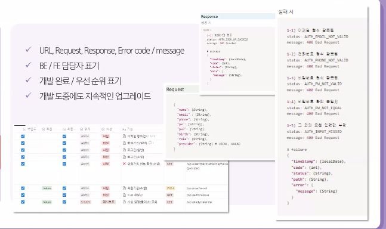
    
  - 아키텍쳐
    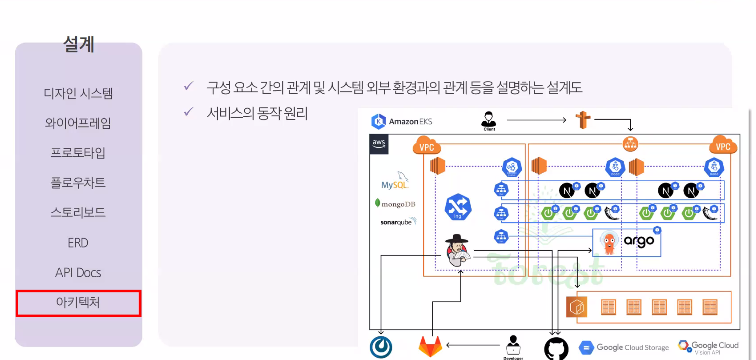
    - 지속적인 미팅을 통해 수정하는것이 좋음

## 개발
  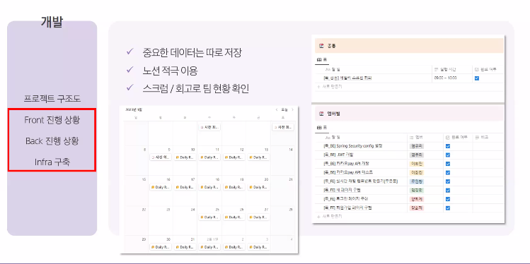

## 테스트
  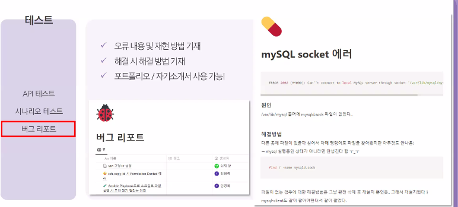

## 오픈/운영
  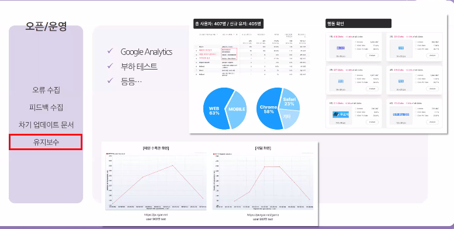
  - 사용자에 대한 데이터 활용 => goole analytics

## 프로젝트 회고
  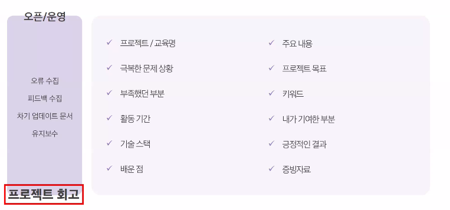
  - 회고가 빠르면 빠를 수록 좋음

# ssafy 개발 환경
  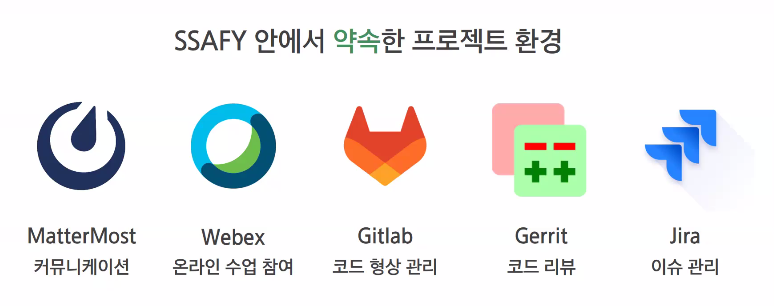

## Mattermost
  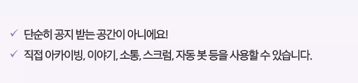 
  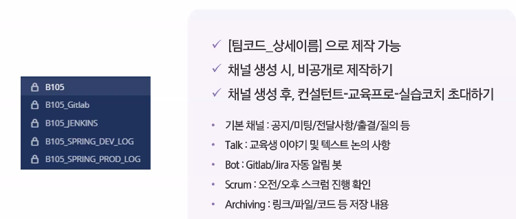

  - mm과 연동은 구글링에 잘 나와 있음

  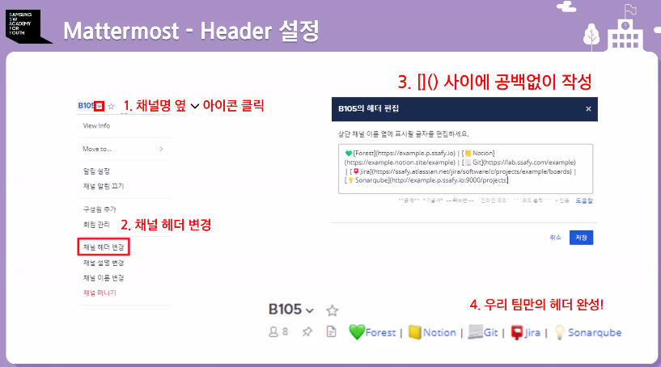
  

## gitlab
- branch
    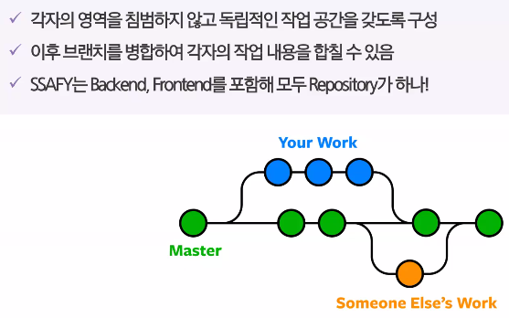

- git-flow

- commit
    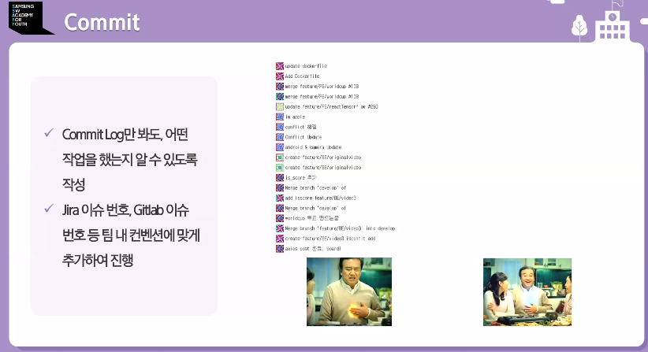
    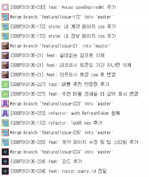

      - 프로젝트 기간 중 1일 1커밋 권장

    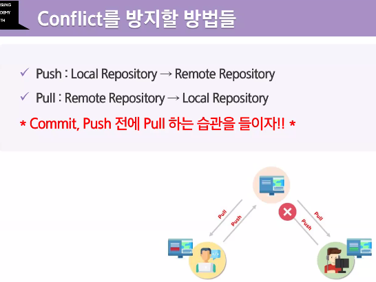
    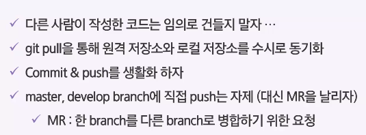

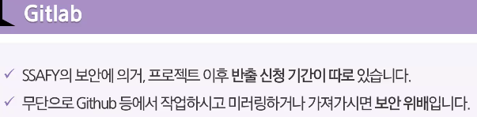

- readme
    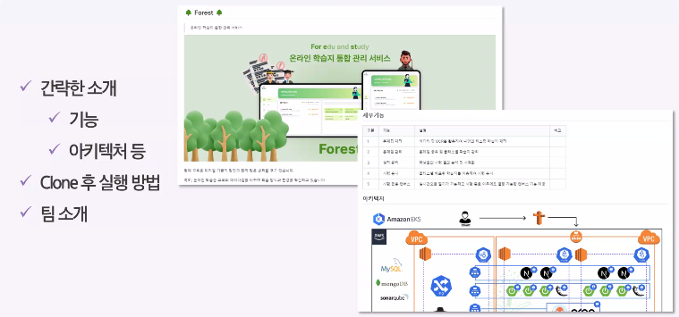

- wiki
    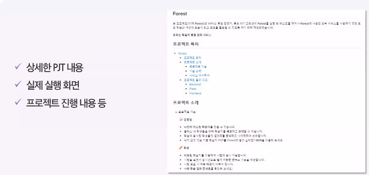

## gerrit(코드리뷰)
- gerrit이란?
    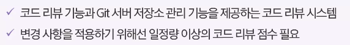

- 구조
    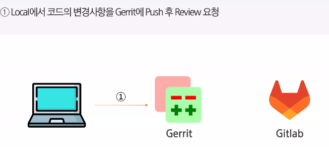
    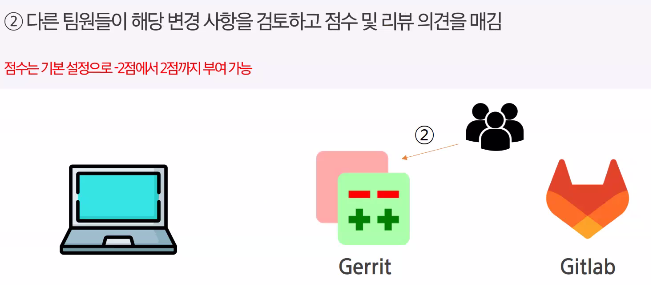
    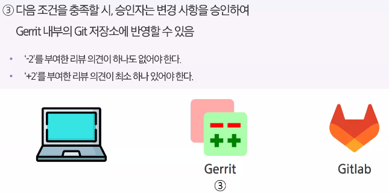
    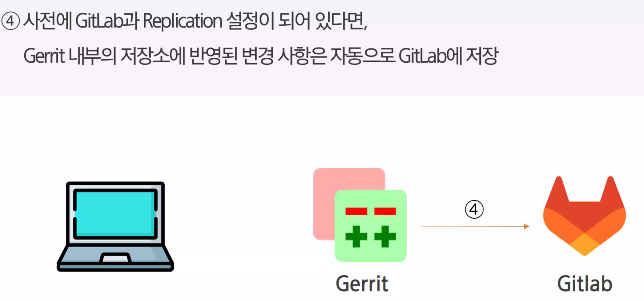

- 기대효과
    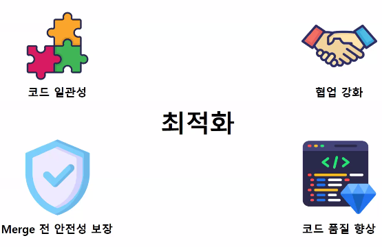

## Jira
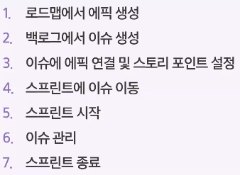

- 백로그와 스프린트
    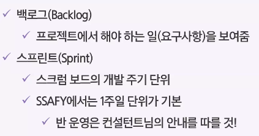

- 이슈
    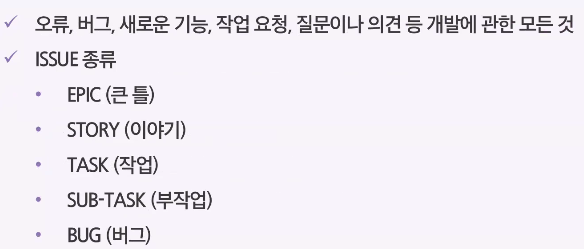

- epic 생성
    

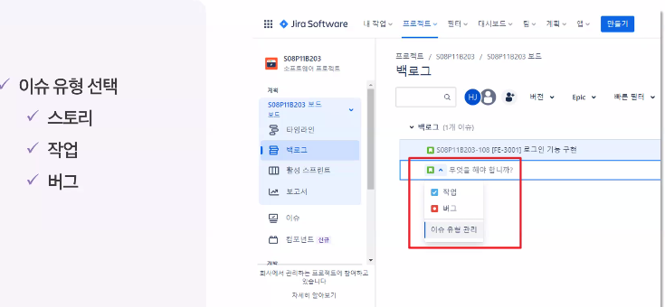
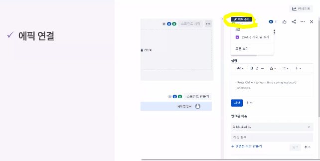
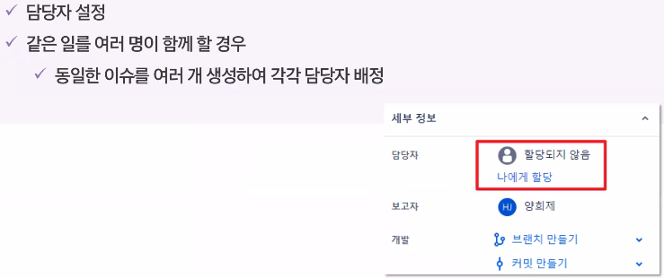

- 스프린트로 옮기기
    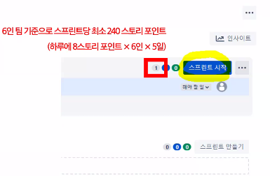

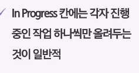

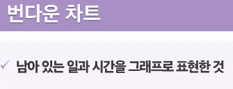
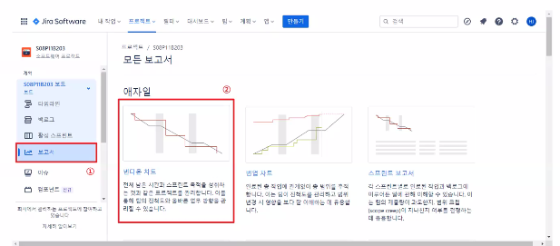
- 이상적인 번다운 차트
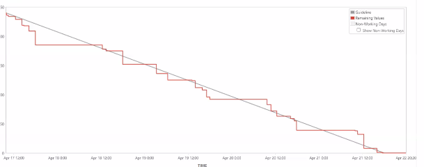

## 자주 발생했던 이슈
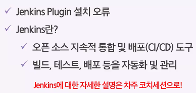
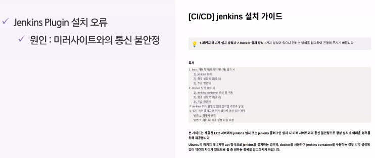

- ssafy 가이드 문서
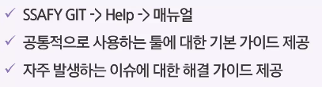
