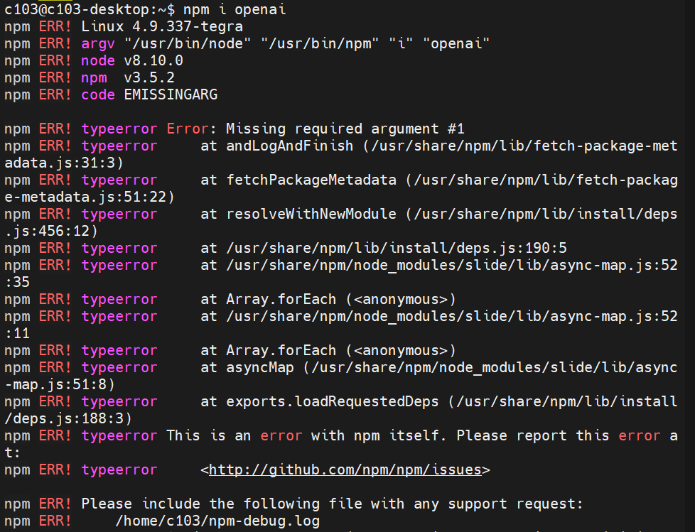
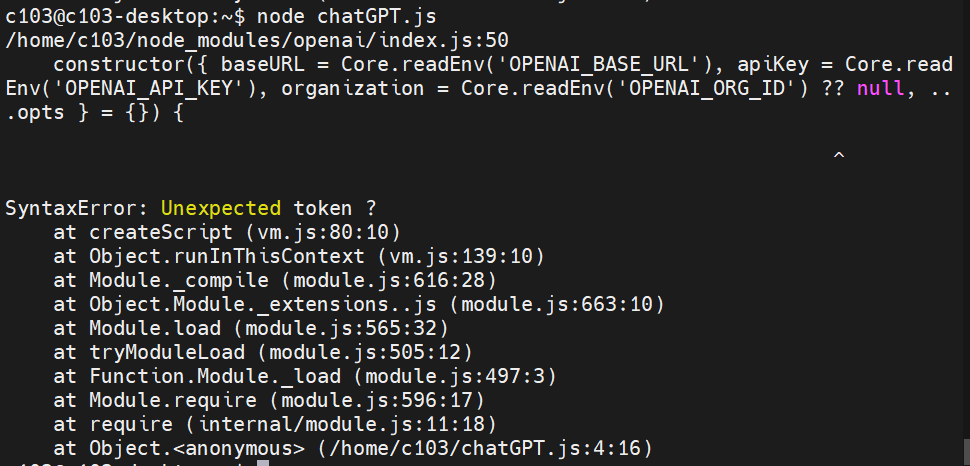

# Embedded 파트를 진행하면서 있었던 Trouble Shooting

## 적외선 수신

### 진행 방법

1. 회로 연결
   - dc - pin 1, gnd - pin 9, data - pin27
2. 라이브러리 다운로드

   `sudo apt-get install lirc`

3. ir 센서 사용을 위한 설정

   - `sudo vi /etc/modules` 에 `lirc_dev`, `lirc_rpi gpio_in_pin=27` 추가

   - `sudo vi /etc/lirc/lirc_options.conf`에서 `driver = default`, `device = /dev/lirc0`으로 변경

   - `sudo reboot`

4. 서비스 실행

   - `sudo /etc/init.d/lircd start`
   - `sudo /etc/init.d/lircd status`
   - `sudo /etc/init.d/lircd stop`
   - `mode2 -d /dev/lirc0`

### Error 내용

1. `sudo /etc/init.d/lircd status`에서 `Error: could not get file information for /dev/lirc0` 에러가 뜸
2. `mode2 -d /dev/lirc0`에서 `Cannot initiate device /dev/lirc0`이 뜸

### 해결 여부

- 미해결
- 여러 자료를 검색해본 결과, lirc는 raspberry pi를 위한 module만 제공하고 있어서 Jetson nano에서는 실행 하지 못하는 것으로 추정
- Jetson nano의 dtoverlay 설정을 찾아보는 중

## 초음파 센서

### 진행 방법

1. 회로 연결
   - dc - pin 2, gnd - pin 6, echo - pin 16, trig - pin 18
2. 아래 코드를 `ultrasonic.py`로 저장 후 실행

   ```python
   import Jetson.GPIO as GPIO
   import time

   echo_pin = 16
   trig_pin = 18

   GPIO.setmode(GPIO.BOARD)

   print("초음파 거리 측정기")

   GPIO.setup(trig_pin, GPIO.OUT)
   GPIO.setup(echo_pin, GPIO.IN)

   GPIO.output(trig_pin, False)
   print("초음파 출력 초기화")
   time.sleep(2)

   try:
      while True:
         GPIO.output(trig_pin, True)
         time.sleep(0.00001)
         GPIO.output(trig_pin, False)
         start = time.time()
         stop = time.time()

         while GPIO.input(echo_pin) == 0:
               start = time.time()
               # print("echo start")

         while GPIO.input(echo_pin) == 1:
               stop = time.time()
               # print("echo end")

         check_time = stop - start
         distance = check_time * 34300 / 2
         print("Distance : %.1f cm" % distance)
         time.sleep(0.4)

   except KeyboardInterrupt:
      GPIO.cleanup()
      print("초음파 측정 종료")

   ```

### Error 내용

- 한 물체를 가까이 가져다댈 경우, echo_pin의 출력이 0으로 고정되면서 측정이 멈춤

### 해결 여부

- 미해결
- 이 문제는 초음파 센서 문제로 생각되어, 초음파 센서를 바꿔서 다시 실행해볼 예정.

## 일기를 토대로 질문하기

### 진행 방법 및 오류

1. Kakao API의 KoGPT를 이용하여 일기를 토대로 질문 생성.
   - "'겨울'의 정의와 겨울과 관련된 규정 말해봐." 와 같이, 평소 대화에서 나누지 않을 주제의 질문이 나오거나, 이상한 답변이 나옴.
2. ChatGPT API를 이용하여 일기를 토대로 질문 생성.

   - `npm i openai` 오류:

     {: width="50"}

   - `yarn add openai` 오류:

     {: width="50"}

   - `yarn --ignore-engines add openai`이후 `node chatGPT.js`오류:

     {: width="50"}

   - node version 업데이트 후 진행
     ```
     wget https://nodejs.org/dist/v17.9.1/node-v17.9.1-linux-arm64.tar.xz
     tar -xJf node-v17.9.1-linux-arm64.tar.xz
     cd node-v17.9.1-linux-arm64
     sudo cp -R * /usr/local/
     node -v
     npm -v
     ```
     - node version update 후 `npm i openai`를 다시 진행하고 스크립트를 돌리자 잘 진행되었다.

### 해결 여부

- 해결
